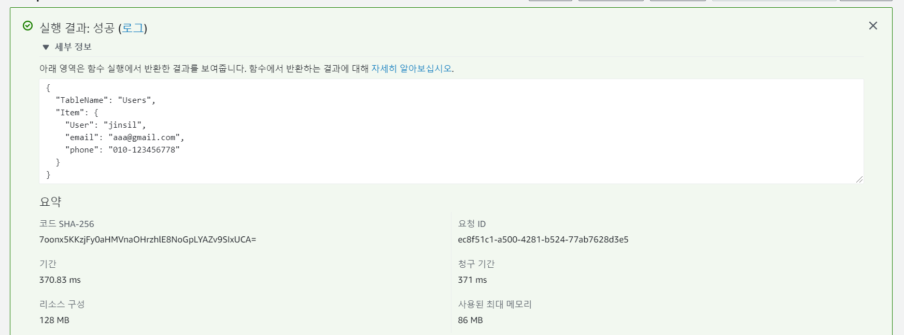

# 정적 웹 호스팅해서 POST request로 DynamoDB에 데이터 추가하는 방법


### 1. DynamoDB 생성

- Users 테이블 만들기

- 기본키: User
- 항목 탭에서 직접 데이터를 추가할 수 있음


### 2. Lambda 생성

- 새로 작성
- 함수 이름 PutUser
- 런타임 Node.js
- 실행역할 - AWS 정책 템플릿에서 새 역할 생성
  - 역할 이름: CreateUsers
- 함수 생성


### 3. 람다 함수 작성

```javascript
var AWS = require('aws-sdk');

AWS.config.update({
    region: 'us-east-1',
    endpoint: "http://dynamodb.us-east-1.amazonaws.com"
});

// DB client로 연결
const docClient = new AWS.DynamoDB.DocumentClient();
exports.handler = function(event, context, callback) {
	// DB에 추가할 값
    var params = {
        TableName: "Users",
        Item: {
            "User": event.name,
            "email": event.email,
            "phone": event.phone
        }
    };

    docClient.put(params, function(err, data) {
        if(err){
            callback(err, null);
        } else{
            // 성공시 params를 response로 전달
            callback(null, params);
        }
    });
};
```

- 배포 후 테스트케이스 생성해서 test

  ```
  {
    "name": "jinsil",
    "email": "aaa@gmail.com",
    "phone": "01012346778"
  }
  ```

  

  - **not authorized ~~ dynamodb:PutItem** error 발생하면

    권한 탭 -  CreateUsers 역할 수정 - 정책 연결 - AmazonDynamoDBFullAccess 정책 권한 추가

    다시 테스트

- DB에 가서 데이터가 저장되었는지 확인


### REST API 생성

- API Gateway  생성 - REST API 구축 - 새 API 
- 이름 User - 생성
- 리소스 생성 - user
- 메서드 생성 - POST 생성 - Lambda 함수 중 PutUser 와 연결

- CORS 활성화


#### 통합 요청 (프록시)

- event 데이터를 API gateway에서 통합 요청을 통해 데이터 형식을 변형해주고 Lambda 함수로 보낼 수 있다.

- 보통 이 방식을 많이 사용

- 매핑 템플릿 - Content-Type 에서 application/json 추가

  ```
  {
    "name":$input.json('$.name'),
    "email":$input.json('$.email'),
    "phone":$input.json('$.phone')
  }
  ```

  템플릿 생성해서 저장


### API 배포

- 새 스테이지 dev


### S3 정적 웹 호스팅 설정

- 버킷 생성 - 이름 : web-hosting-practice

- 권한 - 모든 퍼블릭 액세스 차단 비활성화

- 버킷 정책 편집

  ```json
  {
      "Version": "2012-10-17",
      "Statement": [
          {
              "Sid": "PublicReadGetObject",
              "Effect": "Allow",
              "Principal": "*",
              "Action": "s3:GetObject",
              "Resource": "arn:aws:s3:::web-hosting-practice/*"
          }
      ]
  }
  ```

- index.html 파일 업로드

  ```html
  
  <!DOCTYPE html>
  <html>
  <head>
    <meta charset="UTF-8" />
    <title>Test</title>
  </head>
  
  <body>
      <div id="wrap">
        <table id="tb">
          <tbody>
            <tr>
                <td class="left_box"><label for="">성명</label></td>
                <td class="input_box"><input type="text" id="name" name="name" /></td>
            </tr>
            <tr>
                <td class="left_box"><label for="">연락처</label></td>
                <td class="input_box"><input type="text" id="phone" name="phone" /></td>
            </tr>
            <tr>
                <td class="left_box"><label for="">이메일</label></td>
                <td class="input_box"><input type="text" id="email" name="email" /></td>
            </tr>
          </tbody>
        </table>
        <input type="button" id="enter" value="CREATE"/>
      </div>
      <script src="https://ajax.googleapis.com/ajax/libs/jquery/3.1.0/jquery.min.js"></script>
  
      <script type="text/javascript">
          var API_URL = 'https://00000000.execute-api.us-east-1.amazonaws.com/배포스테이지/리소스';
          /*
          * API_URL은 API Gateway에서 API를 배포한 뒤 리소스를 누르면 나오는 URL 을 복붙하시면 됩니다.
          */
  
          $(document).ready(function () {
  
              $('#enter').on('click', function () {
                  $.ajax({
                      type: 'POST',   //API Gateway를 만들때, POST로 만들었으므로 타입을 POST로 지정
                      error: function(xhr, status, error){
                          console.log(error);
                      },
                      url: API_URL,
                      data: JSON.stringify({
                          "name": $('#name').val(),
                          "email": $('#email').val(),
                          "phone": $('#phone').val()
                      }),
                      contentType: "application/json",
                      //API Gateway 설정에서 매핑 템플릿을 설정하였으므로 그 이름과 동일하게 씀
  
                      success: function (data) {
                          console.log('성공!');
                          // location.reload();
                          console.log("success");
                      }
                  });
              });
          });
      </script>
  
    </body>
    </html>
  ```

  - 속성 - 정적 웹 사이트 호스팅 -  인덱스 문서를 index.html 로 설정


### 테스트

- S3 버킷 url을 브라우저에서 접속
- name, email, phone을 영어로 입력 (현재 한글 인코딩이 안되는 상태) 하고 create 버튼 클릭
- dynamodb에 값이 저장되었고, console 에서 성공 메시지를 확인


