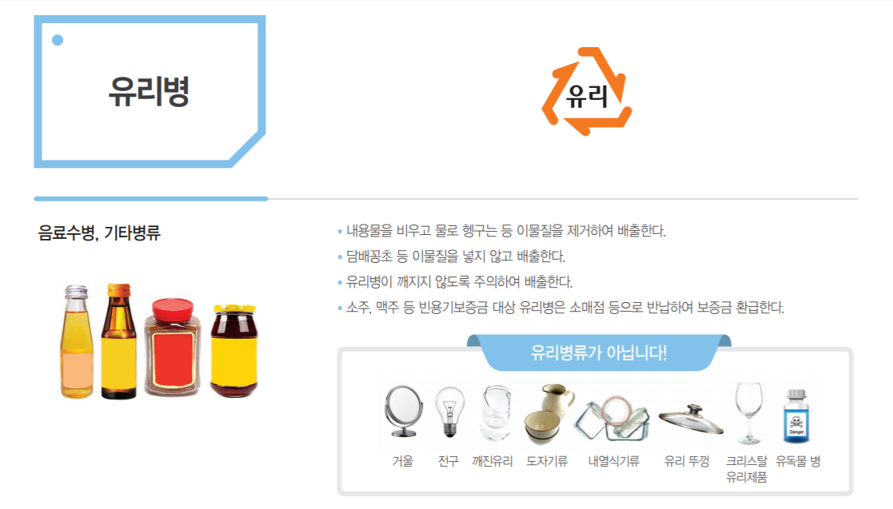
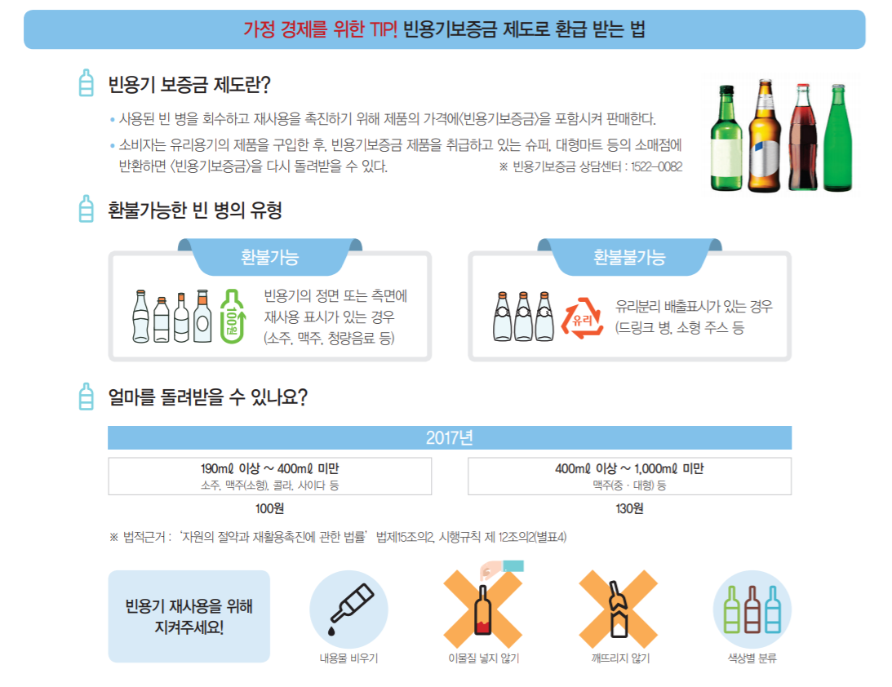

# -Convergence_project_cloud

## 회의록

#### 11월 - 12월

| 월                            | 화                            | 수                            | 목                            | 금                            | 토                           |
| ----------------------------- | ----------------------------- | ----------------------------- | ----------------------------- | ----------------------------- | ----------------------------- |
| [23](meeting.md#회의록-201123) | [24](meeting.md#회의록-201124) | [25](meeting.md#회의록-201125) | 26 | [27](meeting.md#회의록-201127) | [28](meeting.md#회의록-201128) |
| [30](meeting.md#회의록-201130) | [01](meeting.md#회의록-201201) | [02](meeting.md#회의록-201202) | [03](meeting.md#회의록-201203) | [04](meeting.md#회의록-201204)  | [05](meeting.md#회의록-201205) |
| [07](meeting.md#회의록-201207) | [08](meeting.md#회의록-201208) | [09](meeting.md#회의록-201209) | [10](meeting.md#회의록-201210) | [11](meeting.md#회의록-201211) | [12](meeting.md#회의록-201212) |
|                               |                               |                               |                               |                               |                               |
|                               |                               |                               |                               |                               |                               |

## 기획안

### 클라우드 필수 기능

- IoT 기기 데이터 소켓 통신 (데이터 중계, 통신)
- DB 서버 관리 (로그 데이터 관리)
- 웹 인터페이스 제공 (사용자 관리, 포인트적립, 재활용 현황 모니터링, 재활용 UI 제작)
- REST API 개발 및 연동 

### 포함 기술

- AWS IoT Core
- AWS Lambda (Nodejs, Python)
- Auth0
- AWS API Gateway (웹 호스팅)
- PostgreSQL, Amazon RDS

### 서비스 아키텍처

### 유리 분리 배출 기준 

- [유리병분리배출](./유리병분리배출기준.md)
  - 출처: 환경부 한국폐기물협회

| 유리(병)       | 재활용/재사용             | 버리는 방법                                                  | 예시                                                         |
| -------------- | ------------------------- | ------------------------------------------------------------ | ------------------------------------------------------------ |
| 깨진 유리      | X                         | 일반 종량제 봉투에 **신문지에 싸서** 배출 양이 많으면 **특수규격마대**를 구매해서 배출 |                                                              |
| 기타 유리 제품 | X                         | 종량제 봉투 or 특수규격마대를 구매하여 배출                  | 내열유리(전자레인지 / 가스레인지용 유리 용기 등) 거울, 차유리, 사기그릇, 항아리, 토기그릇, 약탕기 등 |
| 잡병           | 재활용 O                  | 유리 수거함에 분리 배출                                      | 유리분리 배출 표시가 있는 모든 병 드링크 병, 소형 주스병 등 |
| 공병           | 재사용 O (보증금 병) | 소매점 등으로 반납해서 보증금 환급 가능 담배꽁초와 같은 **이물질**이 있으면 환급 X *** 보증금 환불 거부 신고시, 최대 5만원까지 보상 | 병뚜껑 or 라벨에 **보증금 환불 문구** 확인 필요 소주, 맥주, 청하, 델몬트 훼미리병, 정종병, 음료수(콜라,사이다), 대병, 버드와이저, 기타 국산 술병 등. |

#### ※ 공병, 잡병이 섞여 있으면 절대 수거 불가능함.

### 환불가능한 재사용 빈 병의 환급금

- 190ml 이상 ~ 400ml 미만: 100원
  - 소주, 맥주(소형), 콜라, 사이다 등
- 400ml 이상 ~ 1,000ml 미만: 130원
  - 맥주(중, 대형) 등

### 재사용 위해 지켜야 할 규칙

- 내용물 비우기
- 이물질 넣지 않기 (씻어서 배출)
- 깨진 유리병 X
- 색상별 분류.....

