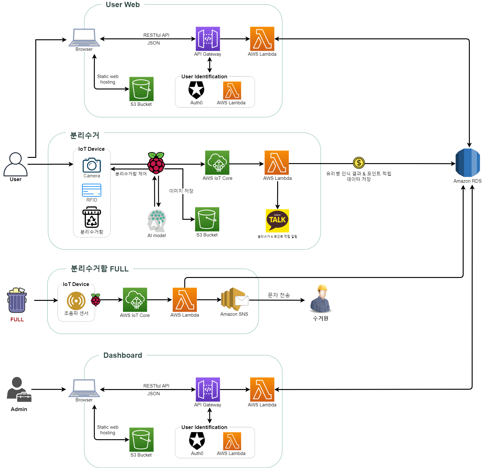

# -Convergence_project_cloud

## 회의록

#### 11월 - 12월

| 월                            | 화                            | 수                            | 목                            | 금                            | 토                           |
| ----------------------------- | ----------------------------- | ----------------------------- | ----------------------------- | ----------------------------- | ----------------------------- |
| [23](meeting.md#회의록-201123) | [24](meeting.md#회의록-201124) | [25](meeting.md#회의록-201125) | 26 | [27](meeting.md#회의록-201127) | [28](meeting.md#회의록-201128) |
| [30](meeting.md#회의록-201130) | [01](meeting.md#회의록-201201) | [02](meeting.md#회의록-201202) | [03](meeting.md#회의록-201203) | [04](meeting.md#회의록-201204)  | [05](meeting.md#회의록-201205) |
| [07](meeting.md#회의록-201207) | [08](meeting.md#회의록-201208) | [09](meeting.md#회의록-201209) | [10](meeting.md#회의록-201210) | [11](meeting.md#회의록-201211) | [12](meeting.md#회의록-201212) |
|                               |                               |                               |                               |                               |                               |
|                               |                               |                               |                               |                               |                               |

## 기획안

### 클라우드 필수 기능

- IoT 기기 데이터 소켓 통신 (데이터 중계, 통신)
- DB 서버 관리 (로그 데이터 관리)
- 웹 인터페이스 제공 (사용자 관리, 포인트적립, 재활용 현황 모니터링, 재활용 UI 제작)
- REST API 개발 및 연동 

### 포함 기술

- AWS IoT Core
- AWS Lambda (Nodejs, Python)
- Auth0
- AWS API Gateway (웹 호스팅)
- PostgreSQL, Amazon RDS

### 서비스 아키텍처

