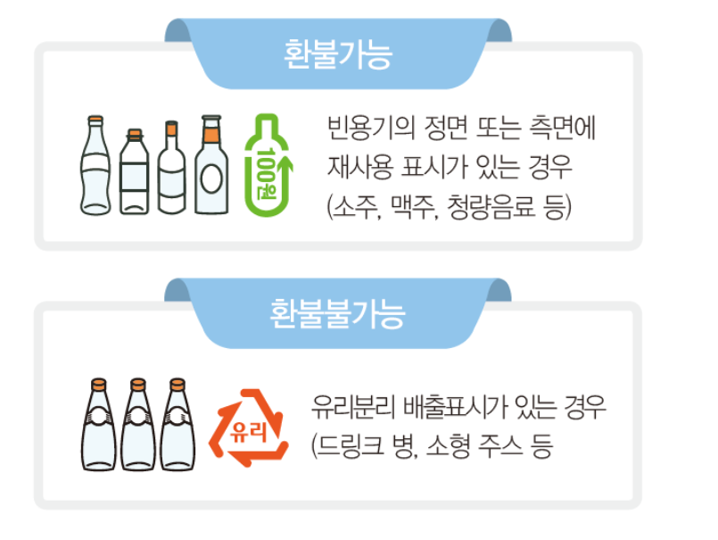
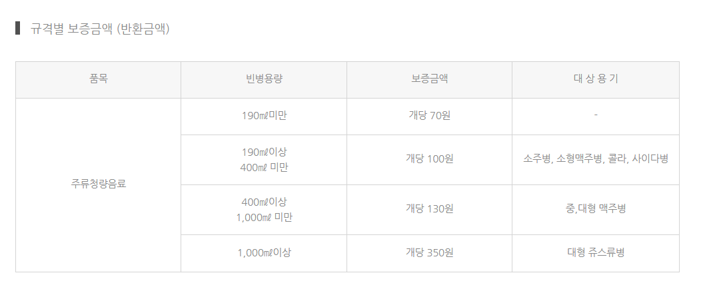
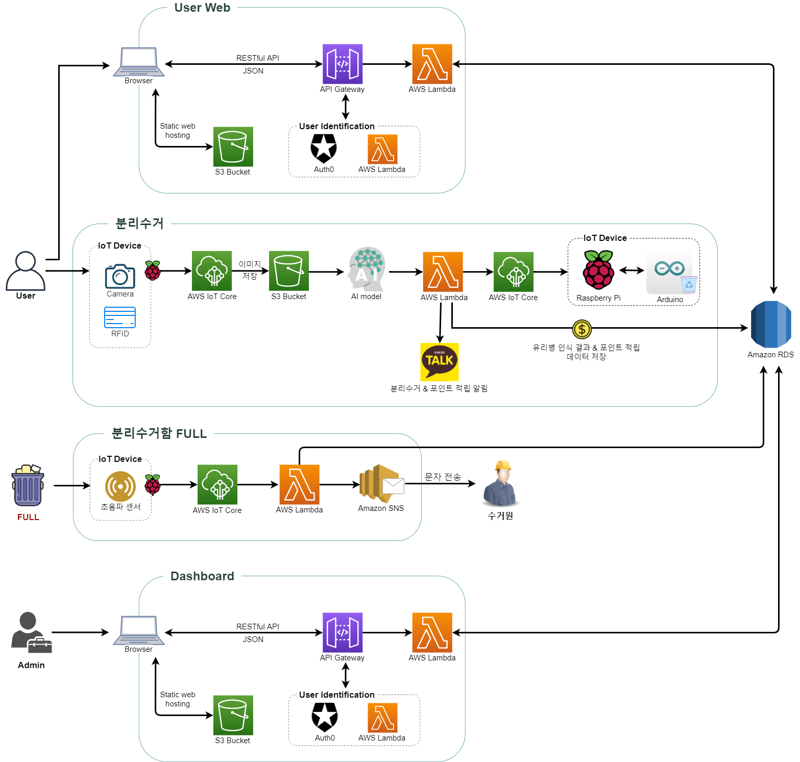

# 회의록 201123

## 클라우드 필수 기능

- IoT 기기 데이터 MQTT로 전송(데이터 중계, 통신)
- DB 서버 관리 (로그 데이터 관리)
- 인터페이스제공RESTful API 개발 및 연동 (사용자 관리, 포인트적립, 재활용 현황 모니터링, 재활용 UI 제작)

## 포함 기술

- AWS IoT Core
- AWS Lambda
- Auto Scaling
- Amazon Cognito, API Gateway
- PostgreSQL, Amazon RDS

# 회의록 201124

## 유리병 분리수거 규칙

## 사용자 시나리오

1. 사용자는 웹으로 회원가입, 카드 발급이 완료되어있어야 한다.
2. 사용자는 카드와 쓰레기를 들고 분류기로 간다.
3. RFID 리더이게 카드를 태그하여 인증한다.
4. 인증이 완료되면 투입구에 쓰레기를 **하나씩** 투입한다.
5. 유리병 하나를 투입하면 분류기는 맥주&소주 / 일반 병 / 쓰레기를 구분하고 포인트를 지급한다.
6. 사용자는 웹과 카카오톡 알림을 통해 분류 처리 및 포인트 적립 현황을 볼 수 있다.

# 회의록 201125

## 오늘의 할 일

- 플로우차트 수정
- 역할분담 수정
- 기획안 수정
- 디비 비교하고 선정 (기획안에 반영)

## 아키텍처 설계

### 데이터 종류

- 모델만들기 위한 데이터 - AI나 빅데이터에서 소유
- 모델
- 새로 식별하기 위한 input 데이터
클라우드는 서비스를 위한 데이터만 가지고 있어야 한다.
디비로 인식결과를 넘겨주면 **클라우드**가 iot로 결과를 전달해주어야한다

### 수정 사항

- ai에서 람다로 가면 람다가 rds에 저장하고 iot core에도 전송
- restful api 호출로 데이터 전송
- ai에서 판정에 사용한 데이터와 인식 결과를 모두 람다로 전달되면 rds에 한번에 데이터 입력할 수 있을 것 같다.
- 두 rds를 하나로 합치는 것이 필요

### AI 모델 적용 방식

- .h5 파일을 활용해서 python코드 인식
- AI측에서 `확률값 중 가장 높은 것 + 이미지 경로(명) + 사용자 id` 를 전달해주면 
  - Lambda함수로 RDB에 저장
  - 포인트 적립 현황을 user에게 알림

### IoT 데이터 통신 방식

- 이미지 파일 통신은 소켓 통신으로

# 회의록 201127

## 오늘의 할일

- 데이터 흐름도(아키텍처) 수정
- REST API 테스트
- 사용자 시나리오 정리

## 사용자 시나리오

@yeunseo 채워주세요

## 아키텍처 설계

### 수정 사항

- AI 모델을 S3 버킷에 저장하여 Lambda로 실행하고 인식결과를 라즈베리파이에 전송
- AWS Cognito → Auth0
- 초음파센서로 분리수거함이 가득 찬 것을 인지하면 수거원에게 AWS SNS로 문자 전송

- IoT 기기와의 통신은 소켓 통신으로 하며 라즈베리파이로 통신할 것