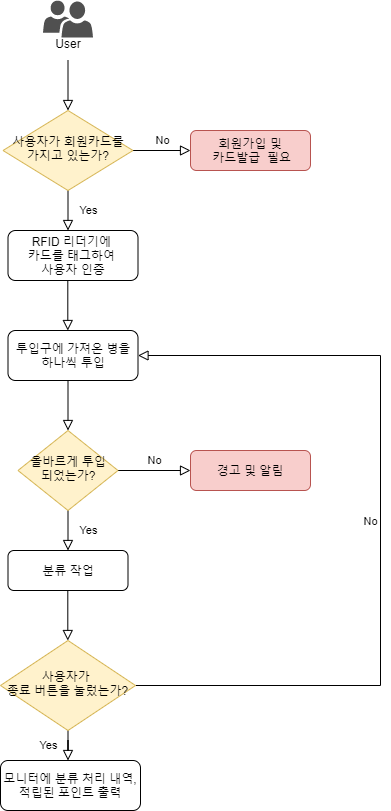
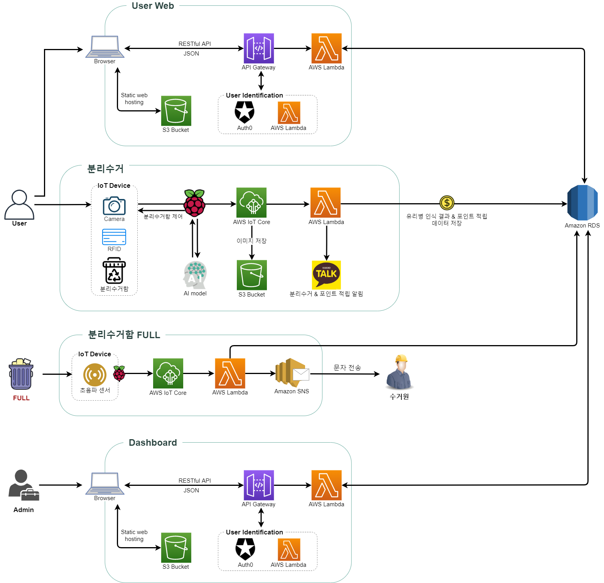
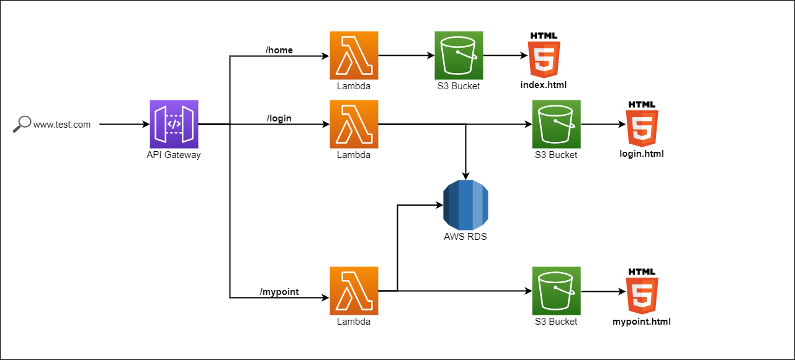

# 회의록 201123

## 클라우드 필수 기능

- IoT 기기 데이터 MQTT로 전송(데이터 중계, 통신)
- DB 서버 관리 (로그 데이터 관리)
- 인터페이스제공RESTful API 개발 및 연동 (사용자 관리, 포인트적립, 재활용 현황 모니터링, 재활용 UI 제작)

## 포함 기술

- AWS IoT Core
- AWS Lambda
- Auto Scaling
- Amazon Cognito, API Gateway
- PostgreSQL, Amazon RDS

# 회의록 201124

## 유리병 분리수거 규칙

## 사용자 시나리오

1. 사용자는 웹으로 회원가입, 카드 발급이 완료되어있어야 한다.
2. 사용자는 카드와 쓰레기를 들고 분류기로 간다.
3. RFID 리더이게 카드를 태그하여 인증한다.
4. 인증이 완료되면 투입구에 쓰레기를 **하나씩** 투입한다.
5. 유리병 하나를 투입하면 분류기는 맥주&소주 / 일반 병 / 쓰레기를 구분하고 포인트를 지급한다.
6. 사용자는 웹과 카카오톡 알림을 통해 분류 처리 및 포인트 적립 현황을 볼 수 있다.

# 회의록 201125

## 오늘의 할 일

- 플로우차트 수정
- 역할분담 수정
- 기획안 수정
- 디비 비교하고 선정 (기획안에 반영)

## 아키텍처 설계

### 데이터 종류

- 모델만들기 위한 데이터 - AI나 빅데이터에서 소유
- 모델
- 새로 식별하기 위한 input 데이터
클라우드는 서비스를 위한 데이터만 가지고 있어야 한다.
디비로 인식결과를 넘겨주면 **클라우드**가 iot로 결과를 전달해주어야한다

### 수정 사항

- ai에서 람다로 가면 람다가 rds에 저장하고 iot core에도 전송
- restful api 호출로 데이터 전송
- ai에서 판정에 사용한 데이터와 인식 결과를 모두 람다로 전달되면 rds에 한번에 데이터 입력할 수 있을 것 같다.
- 두 rds를 하나로 합치는 것이 필요

### AI 모델 적용 방식

- .h5 파일을 활용해서 python코드 인식
- AI측에서 `확률값 중 가장 높은 것 + 이미지 경로(명) + 사용자 id` 를 전달해주면 
  - Lambda함수로 RDB에 저장
  - 포인트 적립 현황을 user에게 알림

### IoT 데이터 통신 방식

- 이미지 파일 통신은 소켓 통신으로

# 회의록 201127

## 오늘의 할일

- 데이터 흐름도(아키텍처) 수정
- REST API 테스트
- 사용자 시나리오 정리

## 웹 인터페이스 요구사항

### 사용자 웹

- 회원가입, 로그인
- 포인트 적립, 포인트 조회, 포인트 사용처 조회
- 올바른 분리수거 방법

### 대시보드

- 날짜/시간대별 이용량(쓰레기의 양)
- 분리수거 성공률
- 사용자 통계(연령대, 성별)

## 사용자 시나리오

1. 사용자는 웹으로 회원가입, 카드 발급이 완료 되어있어야 한다.

2. 사용자는 카드와 쓰레기를 들고 분류기로 간다.

3. RFID 리더기에 카드를 태그 하여 인증한다.(분류기의 조명과 카메라 전원ON)

4. 사용자는 쓰레기를 **하나씩** 투입한다.

5. 유리병 하나를 투입하면 분류기는 **맥주&소주/일반 병/쓰레기**인지 구분하고 포인트를 지급처리를 한다.

6. 사용자는 모니터를 통해 분류 처리, 포인트 적립 상황을 볼 수 있다.

7. 사용자가 분리수거 할 수 없는 쓰레기를 투입한 경우, 쓰레기를 반환하지는 않는다.

8. 사용자는 쓰레기 투입을 모두 끝내면 종료 버튼(혹은 RFID 한 번 더 찍어서 로그아웃)을 누른다

## 아키텍처 설계

### 수정 사항

- AI 모델을 S3 버킷에 저장하여 Lambda로 실행하고 인식결과를 라즈베리파이에 전송
- AWS Cognito → Auth0
- 초음파센서로 분리수거함이 가득 찬 것을 인지하면 수거원에게 AWS SNS로 문자 전송

- IoT 기기와의 통신은 소켓 통신으로 하며 라즈베리파이로 통신할 것

# 회의록 201128

## 멘토링 피드백

- 버튼없이 자동 종료되는 로직도 고려해보자 (시간 체크해서)
- 라즈베리파이랑 아두이노 둘다 쓰지 말고, 라즈베리파이만 써서 제어하는 것을 고려하자
- 일단 가상계정을 만들고 - 시간되면 카카오톡 회원가입 구현하는 방향으로
- 카카오톡 메시지 템플릿 고려
- 대시보드 - 분리수거 성공률, 데이터를 목적에 맞게 어떻게 시각화할지를 고민 많이 해야할듯
- 포인트 받으려고 스캔하는 것을 방지하는게 필요
- 개방된 박스를 현재 사용하고 있기 때문에 폐쇄적인 휴지통을 개방적으로 수정할 필요가 있다.

### 참고

- 람다아키텍처
  - 배치성 데이터와 실시간 데이터를 합치는?

- 엣지디바이스
  - iot기기에서 ai모델돌리고 결과만 클라우드에 전달해주는 방식으로
  - https://www.tensorflow.org/lite?hl=ko

## 먼저 구상해야 할 부분

- 분리수거함 재구상
- 카메라 위치 / 조명 정하기
- 대시보드 웹 내용 & 필요한 데이터

- 

# 회의록 201130

### 아키텍처 수정 사항

- AI 모델을 S3 버킷에 저장하지 않고, 라즈베리파이에서 실행하도록 수정

- 라즈베리파이가 아두이노와 통신하여 아두이노가 하드웨어 제어하지 않고,

  라즈베리파이가 직접 하드웨어를 제어하도록 수정
  
- 라즈베리파이 카메라로부터 받아온 이미지를 AWS IoT Core를 통해 S3 버킷에 저장하지 않고,

  라즈베리파이에서 S3 버킷으로 바로 전송하도록 수정

### 웹 아키텍처 상세

# 회의록 201201

- DynamoDB + Lambda + API Gateway - [Put Item test](./DBPut_using_apigateway.md)

- API Gateway 웹 배포 테스트 - [API Gateway  S3 Proxy](./API게이트웨이 S3 프록시.md)

# 회의록 201202

- AWS RDS 테스트

  - AWS RDS postgresql 데이터베이스 생성

  - postgresql을 pgadmin4와 연동하여 쿼리문 작성 테스트

  - Lambda 함수에서 AWS RDS 로 쿼리문 작성 테스트 (진행중)

    - 문제점: python 모듈 psycopg2 호출 실패

    - 시도하고 있는 방법: serverless framework 로 lambda함수를 작성하고 배포할 때 psycopg2를 포함하여 배포

